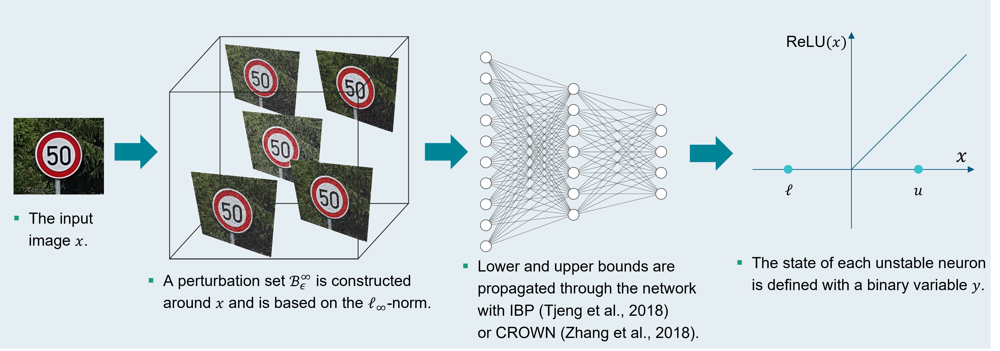

# HQ-CRAN: Hybrid Quantum-Classical Robustness Analyzer for Neural Networks

This repository contains the code for re-producing the experiments of the papers: 
1. [Quantum Robustness Verification: A Hybrid Quantum-Classical Neural Network Certification Algorithm](https://ieeexplore.ieee.org/abstract/document/9951230)
2. [Efficient MILP Decomposition in Quantum Computing for ReLU Network Robustness](https://arxiv.org/abs/2305.00472)

presented at [IEEE Quantum Week - IEEE International Conference on Quantum Computing and Engineering (QCE)](https://qce.quantum.ieee.org/2023/) in 2022 and 2023, respectively.

##  Overview of HQ-CRAN


Robustness certification of neural networks can be modelled as Mixed-Integer Linear Program (MILP).



HQ-CRAN uses two decomposition methods (Benders & Dantzig-Wolfe) to split the original MILP problem into a linear program (LP) and quadratic unconstrained binary optimization (QUBO), solved by classical and quantum algorithm, respectively. 


## Experiments 

We evaluate HQ-CRAN against one complete verifier: 
* [𝜷-CROWN](https://github.com/huanzhang12/alpha-beta-CROWN)

and two incomplete verfiers:
* [PRIMA](https://github.com/eth-sri/eran) 
* [GPUPoly](https://github.com/eth-sri/eran)

In terms of certified accuracy, HQ-CRAN-BD performs similarly to 𝛽-CROWN. On the contrary, the average runtime is ∼2 orders of magnitude slower than incomplete methods and ∼1 order than 𝛽-CROWN.
In the context of HQ-CRAN-DW, the number of certified samples is similar than GPUPoly and PRIMA for $\epsilon$ values greater than $\frac{8}{255}$ but lower than exact verifiers such as $\beta$-CROWN and HQ-CRAN-BD.

<figure>
    <p align="center">
        
        
        <center> 
            Certified accuracy and average runtime of MLP2x[20] and PGD2x[20] for β-CROWN, GPUPoly, PRIMA and HQ-CRAN-BD and HQ-CRAN-DW on the first 100 samples from the MNIST test set with an increasing perturbation budjet ε. 
        </center>
    </p>
</figure>

## Installation

Create a minimal environment with only Python installed in it.

````bash
conda create -y -n hq-cran python=3.8
````
Activate your new environment.
````bash
conda activate hq-cran
````
Next, install the requirements.
````bash
pip install -r requirements
````

## USE

Activate your environment.
````bash
conda activate qc-cert
````
In this folder run 
```bash
python hqcran/. --config config_example.yaml
```

## Configuration

```yaml
onnxpath: str = None               # ONNX network path 
netname: str = None                # network name
torchpath: str = None              # torch network path
dataset: str = None                # dataset path (CSV file)     
output: str = None                 # output folder (python dictionary)
solver: str = None                 # solver type: cplex, ibm_simulator, ibm_cloud, dwave_hybrid, dwave_qpu, dwave_simulator 
epsilon: float = 0.001             # adversarial power for the l-infinity norm
weight_t: int = 1                  # penalization value for the quadratic term
weight_p: float = 0.01             # weights to properly adjust the approximation of p
weight_x: float = 0.01             # weights to properly adjust the approximation of x
sub_bound: int = 5                 # maximum value for the sub bounds (alpha, beta)
objectives_gap: float = 0.1        # Gap between the master and sub objective (xi)
start: int = None                  # starting test
end: int = None                    # ending test
steps: int = 100                   # maximum number of steps for the hybrid algorithm
classic: bool = True               # pure classic solver to True if you want to have a comparison with classic solvers
dwave_reads: int = 100             # number of reads of the D-Wave QPU system
threads: int = 32                  # maximum number of Threads
verbose: bool = False              # Set debug to True if you want to visualize every output 
real_var: bool = False             # real variables for debugging the benders decomposition
qubo: bool = True                  # QUBO formulation to True (False works only with real variables)
magnanti: bool (Default True)      # generation of Magnanti & Wong cuts
hamming: bool = False              # strenght factor for the Hamming distance from the previous solution
max_cuts: int = np.inf             # maximum number of cuts in the set
gurobi: bool = False               # Gurobi optimizer instead of CPLEX
decomposition: str = None          # decomposition strategy: can be either benders or dantzig-wolfe
crown_ibp: bool = True             # verify sample with initial bound from CROWN IBP
```
## Resources 
### CPLEX License

To obtain a CPLEX academic license follow `Get the no-cost academic edition` at this link [CPLEX OPTIMIZATION STUDIO](https://www.ibm.com/products/ilog-cplex-optimization-studio/pricing). Go on software and select **ILOG CPLEX OPTIMIZATION STUDIO** and **download**. Create an account and follow the instructions. Once you get the linux bash script `ILOG_COS_20.10_LINUX_X86_64.bin` run it and define your local installation path `/home/yourname/ibm/ILOG/CPLEX_Studio201`. After that you can move inside the python folder (`/home/yourname/ibm/ILOG/CPLEX_Studio201/python`) and install the api with `python setup.py install`

### D-Wave Access

Create an account on [D-Wave Cloud](https://cloud.dwavesys.com/leap/) and follow the [instructions](https://docs.ocean.dwavesys.com/en/latest/overview/sapi.html#sapi-access)


# Purpose of this project
This software was solely developed for and published as part of the publication cited above. It will neither be maintained nor monitored in any way.

## CITATION

Please cite our paper if you use HQ-CRAN in your research.

1. [Quantum Robustness Verification: A Hybrid Quantum-Classical Neural Network Certification Algorithm](https://ieeexplore.ieee.org/abstract/document/9951230)
    ```bibtex
    @INPROCEEDINGS{9951230,
    author={Franco, Nicola and Wollschläger, Tom and Gao, Nicholas and Lorenz, Jeanette Miriam and Günnemann, Stephan},
    booktitle={2022 IEEE International Conference on Quantum Computing and Engineering (QCE)}, 
    title={Quantum Robustness Verification: A Hybrid Quantum-Classical Neural Network Certification Algorithm}, 
    year={2022},
    volume={},
    number={},
    pages={142-153},
    doi={10.1109/QCE53715.2022.00033}}

2. [Efficient MILP Decomposition in Quantum Computing for ReLU Network Robustness](https://ieeexplore.ieee.org/document/10313804)
    ```bibtex
    @INPROCEEDINGS{10313804,
    author={Franco, Nicola and Wollschläger, Tom and Poggel, Benedikt and Günnemann, Stephan and Lorenz, Jeanette Miriam},
    booktitle={2023 IEEE International Conference on Quantum Computing and Engineering (QCE)}, 
    title={Efficient MILP Decomposition in Quantum Computing for ReLU Network Robustness}, 
    year={2023},
    volume={01},
    number={},
    pages={524-534},
    doi={10.1109/QCE57702.2023.00066}}
